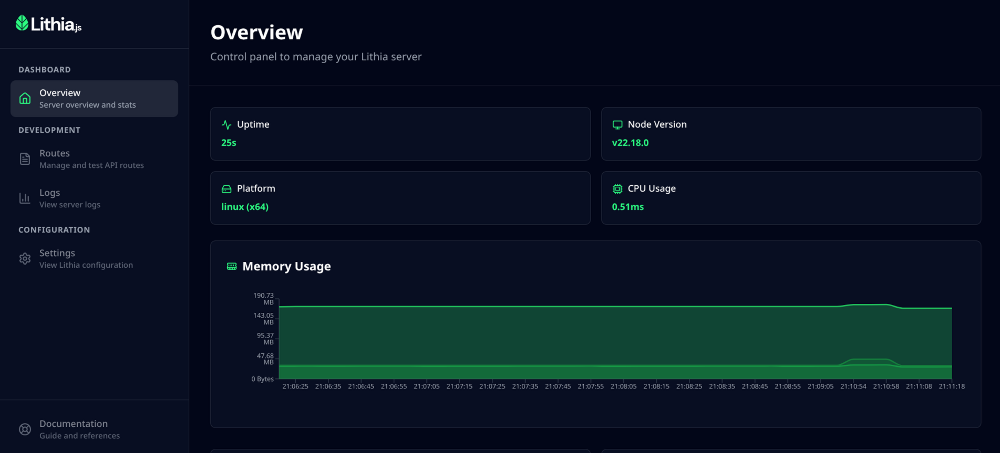
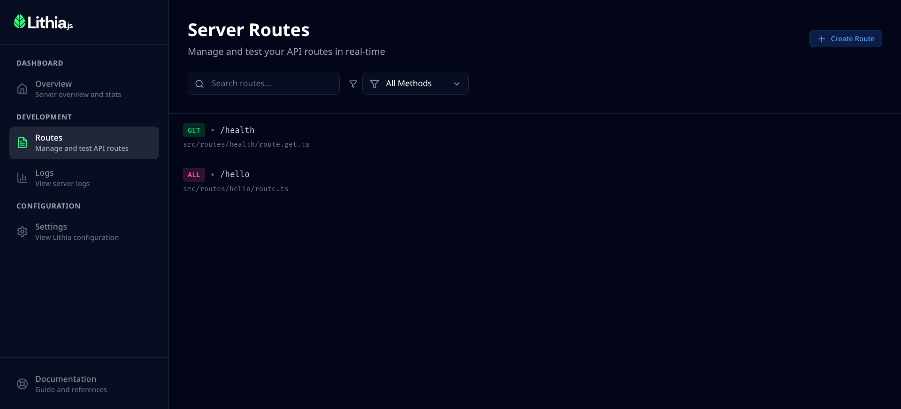
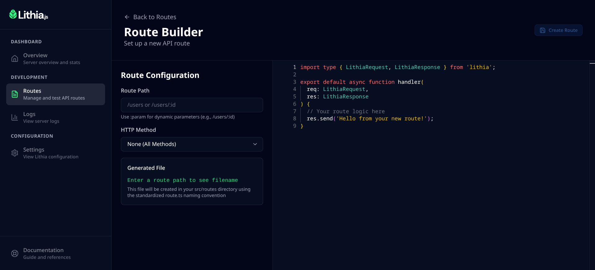
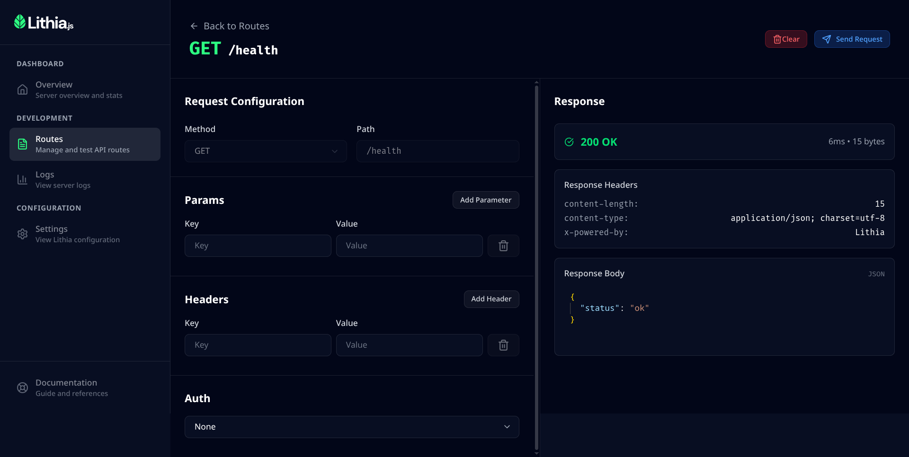
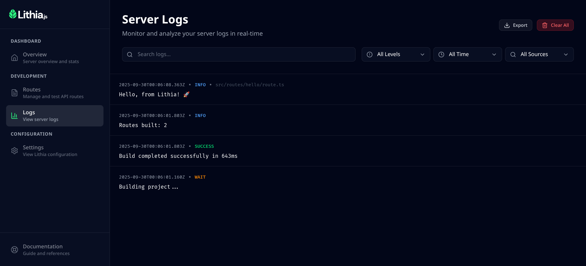
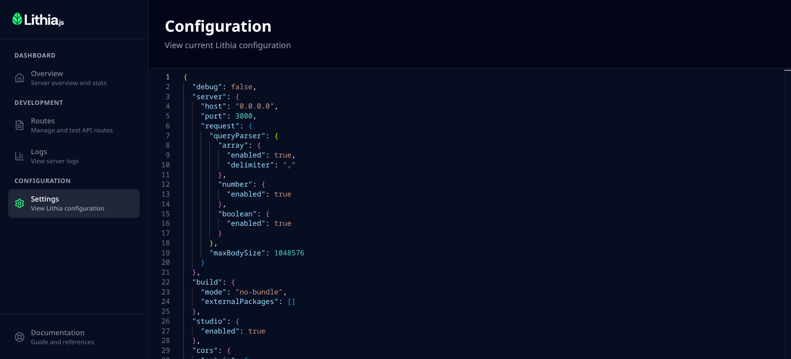

<div align="center">
  <a href="https://github.com/lithia-framework/lithia">
    
  </a>
  <h1>Lithia</h1>
  <p><strong>The Node.js framework that makes API development feel like magic</strong></p>

<a href="https://github.com/lithia-framework/lithia"></a>
<a href="https://www.npmjs.com/package/lithia"></a>
<a href="https://github.com/lithia-framework/lithia/blob/main/LICENSE"></a>
<a href="https://opencollective.com/lithiajs"></a>

</div>

---

## Why Lithia?

Building APIs shouldn't require endless boilerplate, complex routing configurations, or juggling between multiple tools. **Lithia changes that.**

```bash
# Create a new Lithia project
npx create-lithia-app my-api
cd my-api
npm run dev
```

**That's it.** Your API is running, hot-reloading, and ready to develop with a beautiful web interface.

### The Problem Lithia Solves

Traditional Node.js frameworks force you to:

- ❌ Manually configure every route
- ❌ Switch between code editor, terminal, and Postman/Insomnia
- ❌ Lose time with server restarts and debugging
- ❌ Fight with TypeScript configurations

**Lithia gives you:**

- ✅ File-based routing - folders become routes automatically
- ✅ Lithia Studio - develop, test, and debug in one place
- ✅ Instant hot reload - see changes in milliseconds
- ✅ TypeScript-first - full type safety out of the box

---

## Quick Start

### Create Your First API

```bash
npx create-lithia-app my-api
cd my-api
npm run dev
```

### Create Your First Route

```typescript
// src/routes/users/route.get.ts
export default async (req, res) => {
  const users = [
    { id: 1, name: 'Alice' },
    { id: 2, name: 'Bob' },
  ];

  return res.json(users);
};
```

**That's it!** `GET /users` is now live at `http://localhost:3000/users`

### Add a Dynamic Route

```typescript
// src/routes/users/[id]/route.get.ts
export default async (req, res) => {
  const { id } = req.params;

  // Your database logic here
  const user = await db.users.findById(id);

  if (!user) {
    return res.status(404).json({ error: 'User not found' });
  }

  return res.json(user);
};
```

Now `GET /users/123` works automatically!

---

## File-based Routing

Lithia's killer feature: **your folder structure IS your API structure**. No configuration needed.

```
src/routes/
├── users/
│   ├── route.ts          # Handles ALL methods on /users
│   ├── route.post.ts     # Handles ONLY POST /users
│   └── [id]/
│       ├── route.ts      # All methods /users/:id
│       └── route.put.ts  # Only PUT /users/:id
├── products/
│   ├── route.get.ts      # GET /products
│   └── [slug]/
│       └── route.ts      # All methods /products/:slug
└── api/
    └── health/
        └── route.get.ts  # GET /api/health
```

### Routing Conventions

| File Pattern      | What it does                 | Example URL                        |
| ----------------- | ---------------------------- | ---------------------------------- |
| `route.ts`        | Handles **all** HTTP methods | Any method on `/path`              |
| `route.get.ts`    | Only GET requests            | `GET /path`                        |
| `route.post.ts`   | Only POST requests           | `POST /path`                       |
| `route.put.ts`    | Only PUT requests            | `PUT /path`                        |
| `route.delete.ts` | Only DELETE requests         | `DELETE /path`                     |
| `[param]/`        | Dynamic route parameter      | `/users/123` → `params.id = "123"` |

### Method-Specific Routes

```typescript
// src/routes/posts/route.post.ts
export default async (req, res) => {
  const { title, content } = req.body;

  const post = await db.posts.create({ title, content });

  return res.status(201).json(post);
};
```

```typescript
// src/routes/posts/[id]/route.delete.ts
export default async (req, res) => {
  const { id } = req.params;

  await db.posts.delete(id);

  return res.status(204).send();
};
```

---

## Lithia Studio

**The game-changer.** Lithia Studio is a complete development environment in your browser.

### What Lithia Studio Gives You:

#### Real-time Dashboard



Monitor your server's health at a glance:

- CPU and memory usage
- Request/response metrics
- Active connections
- Performance graphs

#### Interactive Route Explorer



Visualize and test your entire API:

- See all routes in a tree structure
- Click to test any endpoint
- View request/response in real-time
- Inspect headers, body, and status codes

#### Visual Route Builder



Create routes without touching code:

- Visual interface to build new routes
- Choose HTTP methods (GET, POST, PUT, DELETE)
- Set up dynamic parameters with `[id]` syntax
- Generate route files automatically
- Preview route structure before creation
- Edit the code before creating the route

#### Interactive Route Tester



Test your API endpoints instantly:

- Send requests with custom headers and body
- Test different HTTP methods
- View real-time responses
- Debug request/response flow

#### Live Logs Viewer



Never leave the browser:

- Stream logs in real-time
- Filter by level (info, warn, error)
- Syntax highlighting
- Search and export logs

#### Live Configuration Viewer



See your server configuration in real-time:

- View current ports, CORS settings, middleware
- Monitor active configuration
- Inspect all server settings at a glance

#### Hot Reload Integration

The fastest development loop:

- Change a file → see results in milliseconds
- No manual server restarts
- No cache issues
- Just pure speed

**Access Lithia Studio:** When your server is running, Lithia Studio is automatically available at `http://localhost:8473`

---

## Core Features

### TypeScript-First

Full type safety without configuration:

```typescript
// src/routes/api/users/route.post.ts
import type { Request, Response } from 'lithia';

interface CreateUserBody {
  name: string;
  email: string;
  age: number;
}

export default async (req: Request<CreateUserBody>, res: Response) => {
  const { name, email, age } = req.body; // Fully typed!

  // Your logic here

  return res.json({ success: true });
};
```

### Hooks System

Extend Lithia at every lifecycle point:

```typescript
// lithia.config.ts
import { defineLithiaConfig } from 'lithia';
import type { LithiaConfig, LithiaRequest, LithiaResponse } from 'lithia/types';

const config: LithiaConfig = {
  server: {
    port: 3000,
  },
  hooks: {
    'request:before': (req: LithiaRequest, res: LithiaResponse) => {
      console.log(`Incoming: ${req.method} ${req.url}`);
    },
    'request:after': (req: LithiaRequest, res: LithiaResponse) => {
      console.log(`Completed: ${res.statusCode}`);
    },
    'request:error': (
      req: LithiaRequest,
      res: LithiaResponse,
      error: Error,
    ) => {
      console.error('Request error:', error);
    },
    'middleware:beforeExecute': (middleware, req, res) => {
      console.log(`Executing middleware: ${middleware.name}`);
    },
    'middleware:afterExecute': (middleware, req, res) => {
      console.log(`Middleware completed: ${middleware.name}`);
    },
    'middleware:error': (middleware, req, res, error) => {
      console.error(`Middleware error in ${middleware.name}:`, error);
    },
  },
};

export default defineLithiaConfig(config);
```

Available hooks:

- **`request:before`** - Before request processing
- **`request:after`** - After request completion
- **`request:error`** - When request fails
- **`middleware:beforeExecute`** - Before each middleware runs
- **`middleware:afterExecute`** - After each middleware completes
- **`middleware:error`** - When middleware throws error

### Lightning-Fast Hot Reload

Change your code and see results **instantly**:

- No server restarts
- No manual refreshes
- State preservation when possible
- Works with Lithia Studio

### Route-Level Middleware

Add middleware directly to your routes:

```typescript
// src/routes/api/users/route.get.ts

// Define middlewares for this route
export const middlewares = [
  async (req, res, next) => {
    // Authentication middleware
    if (!req.headers.authorization) {
      return res.status(401).json({ error: 'Unauthorized' });
    }
    next();
  },
  async (req, res, next) => {
    // Logging middleware
    console.log(`${req.method} ${req.url}`);
    next();
  },
];

// Your route handler
export default async (req, res) => {
  const users = await db.users.findAll();
  return res.json(users);
};
```

---

## Comparison

| Feature                | Lithia  | Express | NestJS |
| ---------------------- | ------- | ------- | ------ |
| File-based Routing     | ✅      | ❌      | ❌     |
| Built-in Dev Interface | ✅      | ❌      | ❌     |
| TypeScript-First       | ✅      | ⚠️      | ✅     |
| Hot Reload             | ✅      | ❌      | ❌     |
| Zero Configuration     | ✅      | ❌      | ❌     |
| Learning Curve         | Low     | Low     | High   |
| Boilerplate            | Minimal | Medium  | Heavy  |

---

## Real-World Example

```typescript
// src/routes/api/todos/route.get.ts
export default async (req, res) => {
  const todos = await db.todos.findAll();
  return res.json(todos);
};

// src/routes/api/todos/route.post.ts
export default async (req, res) => {
  const { title } = req.body;
  const todo = await db.todos.create({ title, completed: false });
  return res.status(201).json(todo);
};

// src/routes/api/todos/[id]/route.put.ts
export default async (req, res) => {
  const { id } = req.params;
  const { completed } = req.body;

  const todo = await db.todos.update(id, { completed });
  return res.json(todo);
};

// src/routes/api/todos/[id]/route.delete.ts
export default async (req, res) => {
  const { id } = req.params;
  await db.todos.delete(id);
  return res.status(204).send();
};
```

**That's a complete CRUD API in 4 files.** No routing configuration. No boilerplate.

---

## Documentation

Visit **[lithiajs.com](https://lithiajs.com)** for:

- Complete API reference
- In-depth guides and tutorials
- Best practices
- Migration guides
- Examples and templates

---

## Contributing

We love contributions! Before getting started, please read our [Contributing Guidelines](CONTRIBUTING.md).

### How to Contribute

1. **Fork** the repository
2. **Clone** your fork: `git clone https://github.com/your-username/lithia.git`
3. **Install** dependencies: `npm install`
4. **Create** a branch: `git checkout -b feature/amazing-feature`
5. **Make** your changes
6. **Test** your changes: `npm test`
7. **Commit** using conventional commits: `git commit -m "feat: add amazing feature"`
8. **Push** to your branch: `git push origin feature/amazing-feature`
9. **Open** a Pull Request

### Types of Contributions

- **Bug Reports** - Use the bug report template
- **Feature Requests** - Use the feature request template
- **Documentation** - Improvements always welcome
- **Ideas** - Share in [Discussions](https://github.com/lithia-framework/lithia/discussions)

---

## Community & Support

- [**GitHub Discussions**](https://github.com/lithia-framework/lithia/discussions) - Ask questions, share ideas
- [**GitHub Issues**](https://github.com/lithia-framework/lithia/issues) - Report bugs
- [**Email**](mailto:support@lithiajs.com) - Direct contact
- [**OpenCollective**](https://opencollective.com/lithiajs) - Support the project

---

## Support the Project

If Lithia makes your life easier, consider supporting it:

- **Star** this repository
- **Share** on social media
- **Sponsor** via [OpenCollective](https://opencollective.com/lithiajs)
- **Report bugs** and suggest improvements
- **Improve documentation**

---

## License

Lithia is [MIT licensed](LICENSE). Free for personal and commercial use.

---

<div align="center">
  <p><strong>Built with ❤️ by the Lithia community</strong></p>
  <p>
    <a href="https://github.com/lithia-framework/lithia">GitHub</a> •
    <a href="https://lithiajs.com">Documentation</a> •
    <a href="https://opencollective.com/lithiajs">OpenCollective</a> •
    <a href="https://github.com/lithia-framework/lithia/discussions">Discussions</a>
  </p>
</div>
